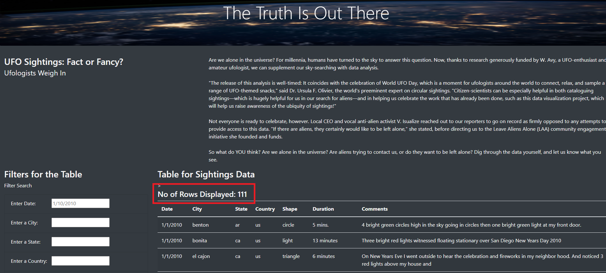
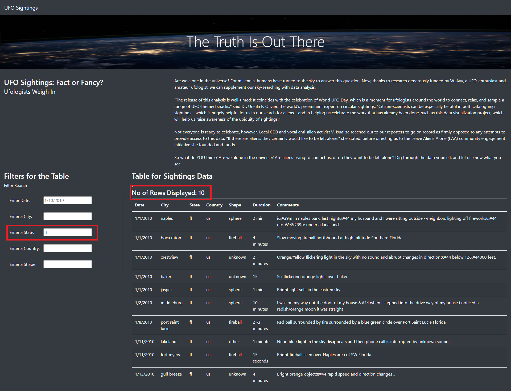
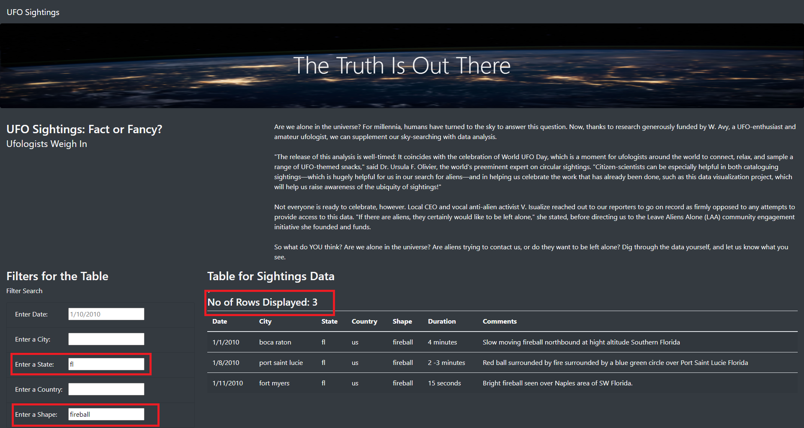

# UFOs 

Goal for UFO Sightings project is to display the details UFO sightings across the world. The data is stored in [data.js](data.js). 

User is also given options to narrow down the UFO Sightings by following filter criteria:
- Date
- City
- State
- Country
- Shape

The solution is built using JavaScript to display dynamic content on the webpage.

The event listener is set for "On Change" for "input type fields". What it means is results will be displayed as user is entering search criteria in any or all of the input fields.

## Results

Let's first take a look at the page when it is loaded initially:

Notice the highlighted section in the image. It displays the total number of results returned. 

So, without any filter the dataset return **111** results.

Now, if a user wants to search by State, they can enter a valid value in State field and the results will be updated for the search criteria. 

*Here is an example:*
User enters **fl** in State field and tabs on keyboard. The result is updated to **10** results.

To add another filter, user can just enter another valid input and the page will display results with narrower search results.

*Here is an example:* User further adds **fireball** to shape search criteria and the results is now narrowed down to **3** rows.

In order to clear the filter, user can just reload the page and results table is populated with original dataset.

## Summary
One drawback of the web page is that it doesn't give any error message if a user types invalid search criteria. 

In order to overcome this challenge, I would recommend:
1. We make City, State, Country and Shape as Selection list. In order to give more options to user, we can even make it as a multi-selection list. The selection list can be populated from the dataset by writing a function for each field. The date field can be made as date-picker field to make it more user-friendly.
2. We should add "Clear All" button to clear the filter criteria. This would avoid the need to reload the page.